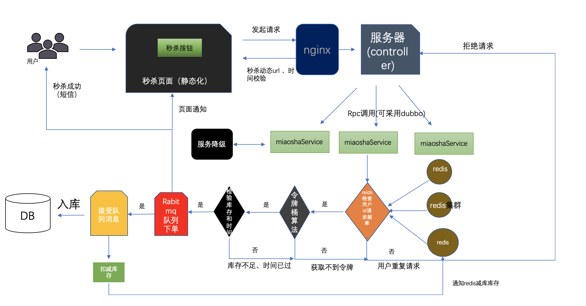
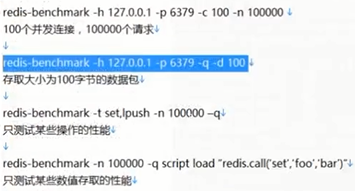

# 秒杀项目

1. 概况
   - 架构
     - 前端：H5, BootStrap, thymeleaf，jQuery
     - 中间件：RabbitMQ, Redis, Druid
     - 后端:SpringBoot, JSR303, MyBatis
   - 架构模型设计图（设计来源：[Yrion](https://www.cnblogs.com/wyq178/)）
     - 

2. 进度
   1. V1.0
      - 基础架构搭建：sprint boost、redis、druid、JSR303、MyBatis
      - 用户登录和分布式Session
   2. V1.1
      - 基础秒杀功能实现
   3. V1.2
      - 生成模拟用户数据
      - 压测
        - 秒杀模块压测：压测结果 3992 （5000*10）
        - 问题：超卖
   4. V1.3 缓存优化+页面静态化
      - V1.3 .1 解决超卖、秒杀页面优化
        - 使用数据库行锁和唯一索引解决
   5. V1.4 
      - 使用redis预加载库存
      - 引入消息队列，异步处理订单
      - 内存标记较少redis访问
   6. V1.5
      - 数据重置api：/miaosha/reset
   7. V1.6
      - 接口隐藏
      - 验证码
      - 接口防刷
        - AcessLimit注解
        - 继承HandlerInterceptorAdapter实现访问拦截去
        - 拦截器集成user解析并存储在ThreadLocal中
        - 基于redis记录访问次数
        - 使用response.getOutputStream实现拦截器中返回前端信息


---

# 秒杀项目错误记录

1. SpringBoot: Could not resolve placeholder 'XXXX' in value "${XXXX}"   驼峰配置注入失败 导入配置项即可
2. Servlet.service() for servlet [dispatcherServlet] in context with path [] threw exception [Request processing failed; nested exception is redis.clients.jedis.exceptions.JedisConnectionException: Could not get a resource from the pool] with root cause
   - redis没有连接上
     - 先尝试localhost
     - bind关掉
       protected-mode no
3. nested exception is com.alibaba.fastjson.JSONException: default constructor not found. class com.xu.miaosha.domain.User] with root cause

- User类需要空参构造器

4. cookies没有在跳转页面获取到

   - ```
     cookie.setPath("/");  //保证同一应用服务器内共享方法
     ```

5. java.lang.IllegalArgumentException: Mapped Statements collection already contains value for ***
   - 环境：springboot
   - 错误原因： MyBatis不允许有重名方法，更改方法名称即可
   - 参考：https://stackoverflow.com/questions/37085803/mybatis-mapped-statements-collection-already-contains-value-for?utm_source=hacpai.com
   
6. rabbitmq远程服务器guest访问受限

   - 修改配置文件，参考：https://www.rabbitmq.com/access-control.html

7. rabbitmq - Fanout模式无法收到msg

   - `amqpTemplate.convertAndSend(MQConfig.FANOUT_EXCHANGE, "", msg);`
   - 主要key位置留空

8. rabbitmq 秒杀队列不存在

   - `org.springframework.amqp.rabbit.listener.BlockingQueueConsumer$DeclarationException: Failed to declare queue`

   - ```java
     @Bean
     // 创建队列
     public Queue queue() {
         return new Queue(QUEUE, true);
     }
     ```

---

# 项目心得

1. 两次MD5
   - 用户端：PASS=MD5(明文+固定salt)  防止用户密码明文传递
   - 服务端：PASS=MD5(用户输入（已经计算的了MD5）+随机salt)   防止数据库被控破，MD5可以反推，双保险
   
2. 分布式session
   - 用户登陆生成（token），和用户信息一起存储到redis中
   - token放在用户cookie中传递
   - 通过获得cookie中的token读取redis中保存的信息
   
3. 压测

   1. JMeter

   2. redis-benchmark

      1. `redis-benchmark -h 127.0.0.1 -p 6379 -c 100 -n 100000`

      2. ```
           # 结果
           100000 requests completed in 1.01 seconds
           100 parallel clients
           3 bytes payload
           keep alive: 1
            
         99.66% <= 1 milliseconds
         100.00% <= 1 milliseconds
         99403.58 requests per second
         ```

      3. 
   
4. 页面优化技术

   1. 页面缓存+URL缓存+对象缓存
      - 页面缓存/URL缓存
        - `       WebContext ctx = new WebContext(request, response, request.getServletContext(), request.getLocale(), model.asMap());`
        - 渲染页面，并存在redis中
      - 对象缓存
        - 将对象转成json存在redis中，如user对象
        - 数据更新时一定要及时修改/删除缓存；
          - 先删除缓存，再更新数据库
            - 在高并发下表现不如意，在原子性被破坏时表现优异
          - **先更新数据库，再删除缓存(`Cache Aside Pattern`设计模式)**
            - 在高并发下表现优异（出现异常的概率很低），在原子性被破坏时表现不如意
   2. 页面静态化，前后端分离
      - 基于Ajax实现页面动态加载
   3. 静态资源优化
      - 压缩js，css文件（去除空白之类的）
      - 整合多个文件，一次请求完成  
      - 工具：webpack、tengine
   4. CDN优化
      1. 内容分发网络
   5. 缓存顺序
      - 浏览器缓存→CDN缓存→Nigix缓存→页面缓存→对象缓存→数据库

5. Service中严禁调用其他Service的Dao，比如存在缓存不一致的问题

6. Mycat 分库分表

7. 接口优化

   - 方式
     - redis预减缓存减少数据库访问
     - 内存标记减少redis访问
     - 请求先入队缓存，异步下单，增强用户体验
     - RabbitMQ
     - Nginx水平扩展
   - 思路：减少数据库访问
     - 系统初始化，把商品库存数量加载到redis中
     - 收到i请求，redis预减库存，库存不足，直接返回，否则进入下一步
     - 请求入队，立即返回排队中
     - 请求出队，生成订单，减少库存
     - 客户端轮询，是否秒杀成功
   
8. 横向扩展

   - nginx:百万级别
   - LVX：亿级别

9. 安全优化

   - 秒杀接口地址隐藏
     - 思路：秒杀开始之前，先去请求接口获得秒杀地址
       - 接口改造，带上PathVarivale参数
       - 添加生成地址的接口
       - 秒杀收到请求，先验证PathVarivale
   - 数学公式验证码
   - 接口限流防刷
     - 